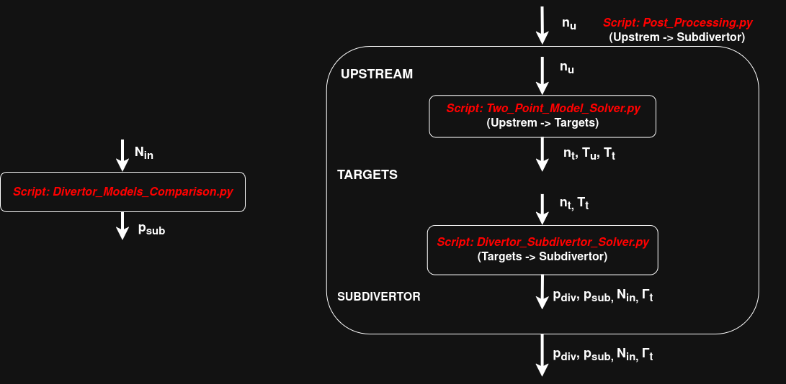

# **Edge Plasma and Particle Exhaust System Modeling of Stellarators and Tokamaks**

## **Overview**
This repository contains the source code supporting my Master's thesis: *"Simplified Modeling of the Edge Plasma Physics and Neutral Gas Exhaust in the Thermonuclear Reactor Wendelstein 7-X"*. 

Specifically, it models edge plasma transport using an extended 0D Two-Point model, and neutral gas transport in the divertor module via particle balance and conductance models.

---

## Nomenclature
A brief definition of the variables used:
* `n_upst` / `n_targ`: Upstream / Target plasma density [m⁻³]
* `T_upst` / `T_targ`: Upstream / Target plasma temperature [eV]
* `Lc`: Connection length [m]
* `x`: Cross-field transport coefficient [m²/s]
* `q_SOL`: Scrape-Off Layer parallel heat flux [MW/m²]
* `loss_alpha`: Momentum loss parameter [eV½]
* `loss_fcool`: Cooling loss fraction [-]
* `loss_fconv`: Convective loss fraction [-]
* `theta`: Magnetic pitch angle [-]
* `N_in_AEH` / `N_in_AEP`: Particle inflow through the AEH/AEP pumping gaps [s⁻¹]
* `p_div`: Divertor pressure [mbar]
* `p_sub`: Subdivertor pressure [mbar]

## **Prerequisites**
The scripts are written in Python 3 and require the installation of the following libraries:
- `numpy`
- `pandas`
- `scipy`
- `matplotlib`
- `PyQt5`
- `emcee` (only for the Bayesian_MAP script)

Install them in bash via: `pip install [LibraryName]`

---

## **Repository Structure**

### 📄 `Two_Point_Model_Solver.py`
Contains solvers for three simplified 0D edge plasma transport models.
Import them via: `from Two_Point_Model_Solver import [SolverName]`

*   **`TTPM`**: Analytical solutions of Stangeby's Tokamak Two-Point model [1]. 
    *   **Inputs**: `n_upst`, `Lc`, `x`, `q_SOL`
    *   **Outputs**: `n_targ`, `T_upst`, `T_targ`

*   **`TTPM_numerical`**: Numerical solver for Stangeby's model.
    *   **Inputs / Outputs**: Same as `TTPM`
   
*   **`Extended_STPM`**: Numerical solver for Feng's Extended Stellarator Two-Point model [2] incorporating three loss parameters.
    *   **Inputs**: `n_upst`, `loss_alpha`, `loss_fcool`, `loss_fconv`, `Lc`, `x`, `theta`, `q_SOL`
    *   **Outputs**: Same as `TTPM`

### 📄 `Divertor_Subdivertor_Solver.py`
Provides analytical models that connect the outputs of the Two-Point model (target conditions) directly to the divertor and subdivertor pressure.

*   **`Divertor_Subdivertor_Analytical`**: Expression pipeline presented in the thesis, using an approximate equation to connect the plasma with the neutral gas.  
    *   **Inputs:** `n_targ`, `T_targ`, `theta`
    *   **Outputs:** `Gamma_targ`, `N_in_x`, `p_div_x`, `p_sub_x` (where x = AEH and AEP)

> **Note:** The user may also want to adjust some fixed parameters like: 
> - Particle capture coefficient: `epsilon_x`,
> - PSI wetting area: `A_wet`
> - Recycling coefficient: `R`

*   **`Divertor_Subdivertor_Dirk`**: Uses the expression from Dirk's IPP presentation about divertor and subdivertor pressures, after assuming that 95% of the incoming plasma particles return to the core.
    *   **Inputs:** `n_targ`, `T_targ`
    *   **Outputs:** `Gamma_targ`, `N_in_x`, `p_div_x`, `p_sub_x` (where x = AEH and AEP)

> **Note:** The user may also want to adjust the fixed parameter: 
> - Particle collection efficiency (= `N_in`/`N_targ`): `PCE`,

### 📄 `Post_Processing.py`
Integrates the two core modules above and provides a parametric post-processing script that solves the problem from the upstream SOL to the subdivertor for Tokamaks and Stellarators. Finally, it compares the resulting predictions against experimental measurements [3].

*   **Inputs**: Choose the desired Divertor-Subdivertor model
*   **Outputs**: Figures of some parameters of interest with respect to the upstream density

### 📄 `Subdivertor_Models_Comparison.py`
Compares closed-form expressions estimating subdivertor pressure (not divertor pressure) against experimental measurements [3]. Moreover, it compares the outflux fractions for two of the models with high-fidelity code results from [4]. 
Import via:`from Subdivertor_Models_Comparison import [ModelName]`

*   **`Varoutis_subdivertor`**: Regression expressions from [5].
    *   **Inputs**: `N_in_AEH`, `N_in_AEP`
    *   **Outputs**: `p_sub_AEH`, `p_sub_AEP`

*   **`Dirk_subdivertor`**: Analytical expression from Dirk's IPP presentation using conductance balance.
    *   **Inputs / Outputs**: Same as `Varoutis_subdivertor`

*   **`Litovoli_Haak_subdivertor`**: 2-reservoir conductance model from [6].
    *   **Inputs**: `N_in_AEH`, `N_in_AEP`
    *   **Outputs**: `p_sub_x`, `N_out_in_x`, `N_leak_in_x`, `N_pump_in_x` (where x = AEH and AEP)
 
*   **`ParticleBalance_subdivertor`**: Particle balance model introduced in this thesis.
    *   **Inputs / Outputs**: Same as `Litovoli_Haak_subdivertor`

### 📄 `Parallel_vs_Perpendicular_Conduction.py`
Compares the parallel and perpendicular heat conduction terms of the heat equation. Outputs a figure showing curves where `q_parallel_conduction = q_perpendicular_conduction` for Tokamaks/Stellarators and electrons/ions.

*   **Inputs**: None
*   **Outputs**: Figure of equilibrium curves.

### 📄 `Bayesian_MAP_and_MCMC_Solver.py`
Solves a toy problem of parameter estimation (MAP), using a simplified analytical Tokamak model and pseudo-data. Additionally, uses Markov Chain Monte Carlo (MCMC) to estimate the posterior distribution under strong vs. weak priors.

---

## **Usage Guidelines**
Follow these rules to reproduce the analysis:
- Do not execute `Two_Point_Model_Solver.py` or `Divertor_Subdivertor_Solver.py` directly; they are module libraries meant to be imported.
- Use `Post_Processing.py` to evaluate the upstream-to-subdivertor flow using only upstream conditions.
- Use the isolated subdivertor models in `Subdivertor_Models_Comparison.py` ONLY when the particle flow (`N_in`) through the pumping gaps is given.

---

## *Flow Chart*

---

## **References**
1. **[Stangeby, P.C. - The Plasma Boundary of Magnetic Fusion Devices]** (https://www.routledge.com/The-Plasma-Boundary-of-Magnetic-Fusion-Devices/Stangeby/p/book/9780750305594)
2. **[N. Maaziz et al 2026 Nucl. Fusion]** (https://iopscience.iop.org/article/10.1088/1741-4326/ae855c)
3. **[V Haak et al 2023 Plasma Phys. Control. Fusion]** (https://iopscience.iop.org/article/10.1088/1361-6587/acc8fb/meta)
4. **[S. Varoutis et al 2024 Nucl. Fusion]** (https://iopscience.iop.org/article/10.1088/1741-4326/ad49b5)
5. **[S. Varoutis et al 2025 Nucl. Fusion]** (https://iopscience.iop.org/article/10.1088/1741-4326/addbf1/meta)
6. **[Litovoli et al 2026 Computation]** (https://www.researchgate.net/publication/399891339_Development_and_Assessment_of_Simplified_Conductance_Models_for_the_Particle_Exhaust_in_Wendelstein_7-X)

---

## **Author**
**Antonis Adamopoulos**
**📧 [antonis.adamopoulos2003@gmail.com](mailto:antonis.adamopoulos2003@gmail.com) | [aadamopoulos@ethz.ch](mailto:aadamopoulos@ethz.ch)**
